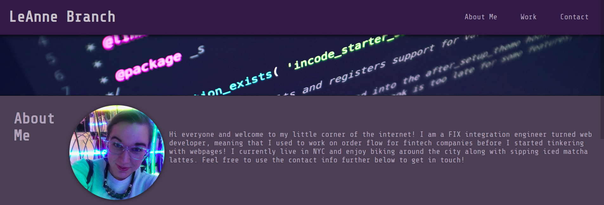

# Module 2 Challenge - Portfolio Webpage

## Description

This is a simple portfolio website showcasing a bit of my work. Enjoy! :) 

## Installation

No installation required! This is a website. 

## Usage

Visit the page here: https://branchwag.github.io/PortfolioWebpage/ 

Screenshot below:

## Credits

Columbia Coding Bootcamp

Background image:
Photo by Luca Bravo on Unsplash
https://unsplash.com/@lucabravo

I would also like to thank the writers of this article for helping me figure out my nav bar situation:
https://dev.to/jungjungie/create-a-navbar-with-css-flexbox-2leh

## License

MIT License
